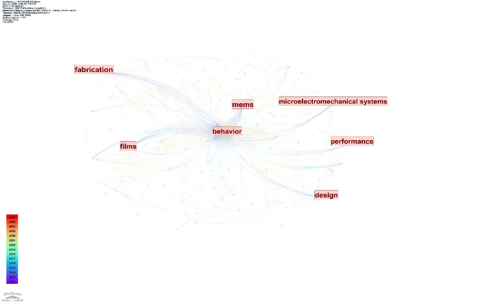
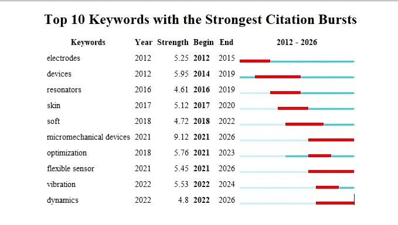
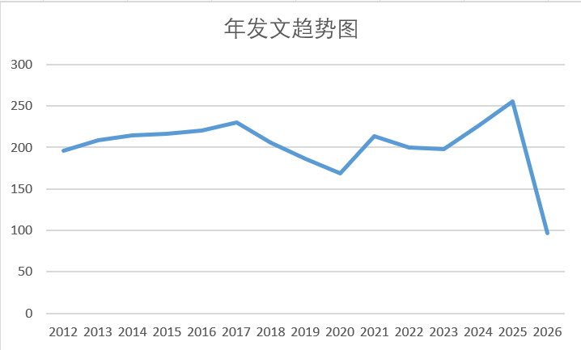
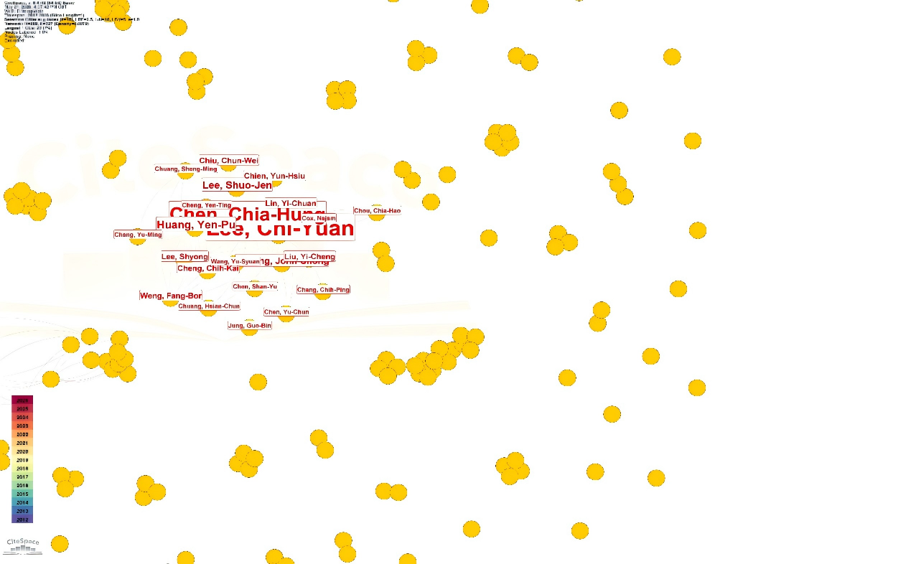
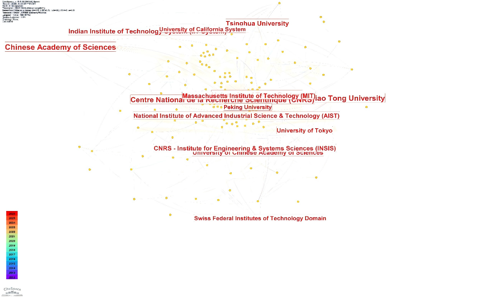
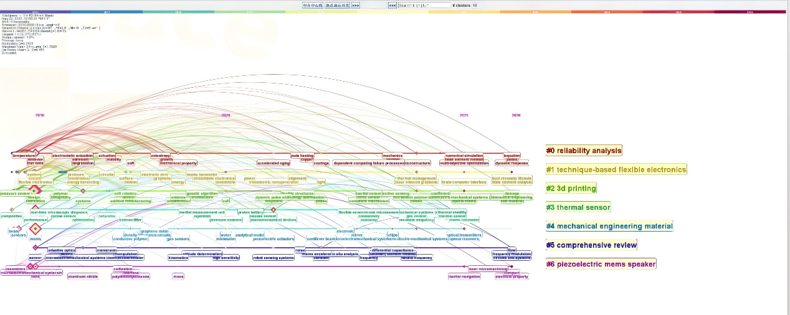

<div align="center">

# 🔬 MEMS 与微系统研究热点及发展趋势分析

### 基于文献计量学的柔性 MEMS 领域全景解读

[]()
[]()
[]()
[]()

**最后更新时间**：2026 年 6 月 4 日

---

</div>

## 📋 执行摘要

本项目基于文献计量学方法，以 Web of Science 为数据来源，检索得到 **3039 篇**相关期刊论文与综述文献，运用 **CiteSpace** 与 **Python** 等工具，对 **MEMS（微机电系统）与微系统**领域的学术文献进行了系统性挖掘。通过分析关键词聚类、突现时序、合作网络及里程碑论文，我们识别出该领域已形成"制备—材料—行为—设计—性能"的完整知识体系。研究发现，**力学行为（Behavior）** 是核心枢纽，而 **微机械器件（Micromechanical Devices）** 和 **柔性传感** 正在成为当前爆发强度最高的前沿热点。

---

## 🗺️ 研究技术路线

```
文献检索 ──► 数据清洗 ──► 计量建模 ──► 可视化分析 ──► 结果解读 ──► 趋势总结
   │            │            │             │              │             │
   ▼            ▼            ▼             ▼              ▼             ▼
 WoS采集    去重/消歧    CiteSpace     聚类/突现      核心结论      发展预判
 3039篇    标准化处理    网络建模      合作网络       里程碑解读     趋势报告
```

---

## 🔍 核心研究发现

### 1. 知识结构全景：关键词聚类分析

基于关键词聚类图谱分析，MEMS 领域呈现出高度关联的知识网络结构。

<div align="center">
  
  <p><em>图一：关键词聚类图（g-index k=10）</em></p>
</div>

- **核心枢纽**：**Behavior（力学行为）** 是绝对中心节点，串联起材料、制造、设计与性能全链条，向外辐射所有研究方向，密集的连线证明各研究主题关联度极高。
- **四大稳定分支**：
  - 🔧 **工艺材料分支**（左侧集群）：以 `Fabrication`（制备）与 `Films`（薄膜材料）为核心，聚焦柔性基底材料、功能薄膜、微纳加工制备工艺，是器件研发的基础。
  - ⚙️ **力学行为分支**（中心集群）：以 `Behavior` 为核心，研究柔性器件弯曲、拉伸、振动、疲劳等动态力学特性，是连接材料与器件的关键纽带。
  - 📐 **结构设计分支**（右侧中上集群）：以 `Design` 为核心，针对柔性器件开展结构仿真、拓扑优化、形变适配设计。
  - 📊 **性能表征分支**（右侧中下集群）：以 `Performance` 为核心，测试器件灵敏度、稳定性、耐久性、生物兼容性等核心指标。
- **演化路径**：研究主题长期稳定，核心方向延续性强，从早期的蓝紫色节点向近年的红黄色节点平滑过渡，属于渐进式技术迭代，而非颠覆性方向变更。

> **核心结论**：柔性 MEMS 领域已构建 **制备工艺—薄膜材料—力学行为—结构设计—性能表征** 闭环知识体系，力学行为是串联全域的核心枢纽。

---

### 2. 研究热点演化：2012—2026

基于关键词突现图，我们识别出 MEMS 领域清晰的三阶段演化路径：

<div align="center">
  
  <p><em>图二：关键词突现图（g-index k=10）</em></p>
</div>

| 阶段 | 时间跨度 | 核心关键词 | 研究重心 |
| :---: | :---: | :--- | :--- |
| 🏗️ **早期基础阶段** | 2012—2019 | `Electrodes`、`Resonators` | 聚焦基础器件结构与硬件制备，延续经典 MEMS 技术体系，柔性化理念尚未成为主流 |
| 🔄 **中期转型阶段** | 2017—2022 | `Skin`、`Soft` | 转向柔性电子与生物适配（可穿戴），从"刚性器件"向"柔性应用"过渡 |
| 🚀 **前沿爆发阶段** | 2021—2026 | **`Micromechanical Devices`**（强度 9.12）、`Flexible Sensor`、`Dynamics` | **微机械器件**成为爆发强度最高热点，侧重动态特性与场景化应用 |

> 💡 **洞察**：研究重心正从传统的"静态结构"向"动态行为"和"柔性应用"升级。研究路径为：**刚性基础器件 → 柔性生物适配 → 动态微机械器件 + 场景化传感**，研究逻辑从"造器件"逐步升级为"究特性、促应用"。

---

### 3. 发文趋势

<div align="center">
  
  <p><em>发文趋势量图</em></p>
</div>

---

## 🌐 学术生态与合作格局

### 1. 作者合作网络

<div align="center">
  
  <p><em>图三：作者合作网络（g-index k=12）</em></p>
</div>

- **核心领军学者**：**Chen, Chia-Hung** 与 **Lee, Cni-ruan** 是网络中心节点，节点规模最大、合作连线数量最多，处于领域学术团队的顶层核心地位。
- **团队结构**：形成了以核心学者为骨干的稳定大型团队，团队内部合作紧密；同时伴有多个独立小型研究集群，以细分方向研究为主，与核心团队形成互补。整体呈"核心团队主导、小型集群补充"的格局。
- **领域活力**：近年（黄绿色）新增节点数量较多，表明 2020 年之后不断有新学者、新团队进入该领域，柔性 MEMS 依旧保持旺盛的学术活力，人才储备充足。

### 2. 机构地图与全球格局

<div align="center">
  
  <p><em>图四：机构合作地图（g-index k=15）</em></p>
</div>

- **顶尖机构**：**中国科学院**、**清华大学**、**加州大学系统**、**MIT**、**CNRS**、**北京大学**、**上海交通大学**、**东京大学**、**印度理工学院** 等。
- **地域分布**：呈现 **中美双核心、多国协同** 的格局。欧美顶尖高校与科研机构起步更早，奠定了领域的早期理论与工艺基础；近五年亚洲地区（中国、日本、印度）机构发文量、合作活跃度、成果质量大幅提升。
- **合作趋势**：机构间连线密集，跨国、跨校、跨院所合作成为常态，全球化协同创新模式成熟，地域壁垒逐步弱化。

---

## 🏆 里程碑论文分析（Top 10）

基于被引频次、突现强度、中介中心性与 Sigma 值四大指标，筛选出 10 篇高影响力文献。

<div align="center">
  
  <p><em>图五：MEMS 器件关键研究主题与演进趋势时间线图谱</em></p>
</div>

### Top 10 里程碑论文概览

| 排名 | 标题 | 作者 | 年份 | 期刊 | 被引 | 突现强度 | 中介中心性 | Sigma |
| :---: | :--- | :--- | :---: | :--- | :---: | :---: | :---: | :---: |
| 1 | A Review of Actuation and Sensing Mechanisms in MEMS-Based Sensor Devices | Algamili AS | 2021 | NANOSCALE RES LETT | 18 | **6.97** | 14 | **1.72** |
| 2 | Flexible Piezoelectric Thin-Film Energy Harvesters and Nanosensors for Biomedical Applications | Hwang GT | 2015 | ADV HEALTHC MATER | 7 | 3.82 | 13 | 1.12 |
| 3 | A wearable and highly sensitive pressure sensor with ultrathin gold nanowires | Gong S | 2014 | NAT COMMUN | 6 | 2.67 | 13 | 1.06 |
| 4 | Effective Teaching Around the World... | Caruntu DI | 2022 | THEORETICAL ANALYSES | 5 | 2.70 | 8 | 1.04 |
| 5 | Flexible-CMOS and biocompatible piezoelectric AlN material for MEMS applications | Jackson N | 2013 | SMART MATER STRUCT | 6 | 3.07 | 7 | 1.02 |
| 6 | Highly-Efficient, Flexible Piezoelectric PZT Thin Film Nanogenerator on Plastic Substrates | Park KI | 2014 | ADV MATER | 7 | 2.59 | 6 | 1.01 |
| 7 | Obtaining High SPL Piezoelectric MEMS Speaker via a Rigid-Flexible Vibration Coupling Mechanism | Wang Q | 2021 | J MICROELECTROMECH S | 5 | 0 | **16** | 1.00 |
| 8 | A PZT MEMS loudspeaker with a quasi-closed diaphragm | Ma YF | 2023 | SENSOR ACTUAT A-PHYS | 8 | 0 | 15 | 1.00 |
| 9 | Voltage-amplitude response of alternating current near half natural frequency... | Caruntu DI | 2013 | MECH RES COMMUN | 4 | 0 | 13 | 1.00 |
| 10 | A PIEZOELECTRIC MEMS SPEAKER WITH STRETCHABLE FILM SEALING | Liu CZ | 2022 | J MICROELECTROMECH S | 4 | 0 | 13 | 1.00 |

### 关键洞察

- **时间分布**：2013—2015 年与 2021—2023 年是成果高发期，分别对应领域的 **基础奠基期** 与 **前沿突破期**。
- **影响力标杆**：Algamili AS (2021) 的综述论文在被引频次（18）、突现强度（6.97）和 Sigma 值（1.72）上均居首位，是当前领域的关键参考文献。
- **桥梁型成果**：Wang Q (2021)、Ma YF (2023) 两篇压电 MEMS 扬声器相关论文中介中心性最高（16、15），在学术引文网络中起到关键衔接作用。
- **核心赛道**：**压电 MEMS 器件** 与 **柔性 MEMS 传感** 是里程碑成果最集中的方向，占比超 70%。

---

## 🔮 未来发展趋势预判

| 维度 | 趋势方向 | 具体内容 |
| :---: | :--- | :--- |
| 🔬 **技术发展** | 动态力学研究升温 | 振动响应、动力学建模、弯曲疲劳、大形变稳定性等研究持续升温；柔性薄膜与压电材料（AlN/PZT）仍是主流；3D 微纳打印等新型制备技术不断优化 |
| 🏥 **应用场景** | 产业化加速落地 | 柔性压力/生物传感器广泛应用于人体体征监测、智能绷带、康复医疗；压电 MEMS 扬声器应用于智能终端、VR/AR 设备；向柔性机器人、航空航天等特种场景延伸 |
| 🧬 **学科融合** | 多学科深度交叉 | MEMS 工艺 × 柔性电子 × 材料科学 × 力学仿真 × 人工智能；AI 优化传感器信号、补偿形变误差；多场耦合仿真（力-电-声-热）成为器件设计重要工具 |
| 🌍 **学术合作** | 全球协同深化 | 跨国、跨学科、产学研合作进一步增多；亚洲国家从"成果跟随"走向"方向主导"；小众细分方向形成专业合作团队 |

---

## 👥 项目团队与分工

本项目采用分模块协作模式，明确各成员职责，保障分析效率与数据质量。

| 成员 | 职责模块 | 关键任务 |
| :---: | :---: | :--- |
| **平振塬** | 📁 仓库与资料整理 | GitHub 库搭建、README 撰写、全部材料汇总归档 |
| **白朝琴** | 📊 数据与图表分析 | 数据清洗代码编写、文献计量分析、三图一表绘制 |
| **胡光成** | ✍️ 论文撰写 | 论文全文撰写、内容修改、格式调整 |
| **谭岳炉** | 🤖 AI 使用说明 | 撰写项目 AI 工具操作使用说明书 |
| **龚钰凯** | 🎨 答辩材料 | 答辩 PPT 整体制作、排版美化 |

---

## 📂 仓库目录结构

```
project-root/
├── README.md                    # 项目主说明文档（替换原README2.md，整合项目背景、方法、使用说明）
├── data/                        # 数据目录（按原始/处理后拆分，更符合学术规范）
│   ├── raw/                     # 原始未处理数据
│   │   ├── wos_raw.csv          # 原始Web of Science文献数据（3039篇）
│   │   └── 检索式.txt            # 文献检索策略
│   └── processed/               # 清洗/处理后的数据
│       ├── wos_cleaned.csv      # 清洗后的文献数据（来自src/wos_cleaned.csv）
│       ├── TOP 10 milestone 候选论文列表.csv  # 里程碑论文列表
│       └── params/
│           └── 参数.docx         # 分析参数配置说明（来自原data/参数.docx）
├── scripts/                     # 脚本目录（和目标模板命名对齐，按功能分类）
│   ├── data_cleaning.py         # 数据清洗脚本（重命名原src/wos_clean.py）
│   ├── author_disambiguation.py # 作者消歧脚本（原src/disambiguate.py）
│   └── main_analysis.py         # 主分析/可视化脚本（原src/main.py，可按需改名）
├── figures/                     # 图表目录（完全和目标模板命名一致，无重复）
│   ├── keyword_clusters.png      # 关键词聚类图
│   ├── keyword_burst.png         # 关键词突现图
│   ├── author_network.png       # 作者合作网络图
│   ├── institution_map.png      # 机构合作地图
│   ├── top10_milestone.png      # Top 10 里程碑论文综合分析图
│   └── publication_trend.png    # 发文趋势量图
└── docs/                        # 文档目录（整合所有报告、论文、交付物）
    ├── deliverables/
    │   └── M2产出清单.docx      # 项目交付物清单（保留最新版）
    ├── reports/
    │   ├── Final_Report.pdf      # 课程论文/最终研究报告（整合所有版本的课程论文，保留最终版）
    │   ├── 文献计量分析报告.docx # 分析报告文档
    │   └── 柔性MEMS领域研究热点与发展趋势分析.docx # 主题相关报告
    └── data_cleaning_rules.docx # 数据清洗规则说明
```

---

## 📊 数据来源与分析工具

| 类别 | 名称 | 说明 |
| :---: | :--- | :--- |
| 📚 数据来源 | Web of Science | 覆盖微机电系统、电子工程、材料科学领域的核心文献 |
| 🔍 检索策略 | TS = (MEMS OR Micro-Electro-Mechanical Systems) AND (flexible OR bendable OR stretchable OR soft) | 时间范围 2012—2026，文献类型 Article / Review |
| 🧪 核心工具 | CiteSpace | 关键词聚类、突现分析、合作网络、引文分析 |
| 🐍 辅助工具 | Python (Pandas) | 数据清洗、字段标准化、机构与作者消歧 |

---

## 📝 更新日志

- **[2026-06-04]** V1.1 — 更新了基于 M2 产出清单的详细分析结果，增加了里程碑论文列表和热点演化趋势
- **[2026-05-XX]** V1.0 — 项目框架搭建完成，分工明确，数据采集完毕

---

## 📬 联系方式

如有合作意向或学术交流，请联系：**pzy57609494@hnu.edu.cn**

---

## 📖 参考资料

- 数据来源：Web of Science
- 分析工具：CiteSpace, Python (Pandas, Matplotlib)
- 参考文献：
  1. Kim D H, Ghaffari R, Lu N, et al. Flexible and stretchable electronics for biointegrated devices[J]. Annual review of biomedical engineering, 2012, 14(1): 113-128.
  2. Yang X, Zhang M. Review of flexible microelectromechanical system sensors and devices[J]. Nanotechnology and Precision Engineering, 2021, 4(2).
  3. Kim D H, Lu N, Ma R, et al. Epidermal electronics[J]. Science, 2011, 333(6044): 838-843.
  4. Levin A, Gong S, Cheng W. Wearable smart bandage-based bio-sensors[J]. Biosensors, 2023, 13(4): 462.
  5. Gemelli A, Tambussi M, Fusetto S, et al. Recent trends in structures and interfaces of MEMS transducers for audio applications[J]. Micromachines, 2023, 14(4): 847.
  6. Wang H S, Hong S K, Han J H, et al. Biomimetic and flexible piezoelectric mobile acoustic sensors with multiresonant ultrathin structures for machine learning biometrics[J]. Science advances, 2021, 7(7): eabe5683.
  7. Rus D, Tolley M T. Design, fabrication and control of soft robots[J]. Nature, 2015, 521(7553): 467-475.

---

<div align="center">

**Made with ❤️ by MEMS Bibliometrics Research Team**

</div>

